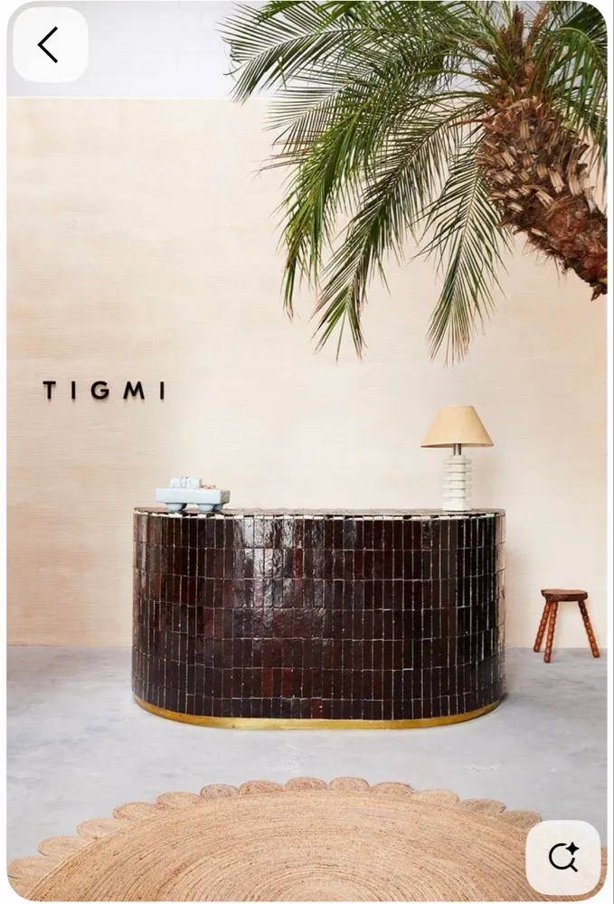

# CLAUDE.md — Cafe24 스마트디자인 프로젝트 규칙

이 프로젝트는 **Cafe24 스마트디자인** 기반 쇼핑몰 스킨입니다.
Cafe24 런타임 환경에서 동작하므로 일반 정적 웹사이트와 다른 제약이 있습니다.
아래 규칙은 모든 작업에서 반드시 지켜야 합니다.

---

## 1. 이미지 파일 처리 규칙 (가장 중요)

### assets/ 디렉터리는 배포 대상이 아닙니다
- `assets/` 폴더는 **로컬 작업용 참고 파일**입니다. Cafe24 서버에는 존재하지 않습니다.
- `assets/` 경로를 HTML/CSS에 직접 삽입하면 **실제 쇼핑몰에서 이미지가 깨집니다**.

### 이미지 사용 절차
이미지를 템플릿에 삽입할 때는 반드시 다음 절차를 따르세요:

1. **Cafe24 관리자 → 디자인 → 파일 첨부** 에서 이미지를 먼저 업로드
2. 업로드 완료 후 Cafe24가 부여한 경로로 참조

업로드 후 경로 패턴:
```
/web/upload/NNE/파일명.확장자          ← 일반 파일 첨부
/web/upload/editor/파일명.확장자       ← 에디터 업로드
/SkinImg/img/파일명.확장자             ← 스킨 이미지 (스마트디자인 편집기 업로드)
```

### 금지 패턴 vs 올바른 패턴
```html
<!-- 금지: 로컬 assets 경로 직접 사용 -->


background-image: url('../assets/handle-black.png');

<!-- 올바름: Cafe24에 업로드 후 실제 경로 사용 -->


background-image: url('/SkinImg/img/handle-black.png');
```

### 이미지 경로를 알 수 없을 때
코드에 이미지를 삽입할 필요가 있는데 아직 업로드 전이라면, 반드시 다음과 같이 안내하세요:
> "이 이미지(`파일명`)는 Cafe24 관리자 → 디자인 → 파일 첨부에서 먼저 업로드한 뒤, 업로드된 경로로 `src` 또는 `url()`을 교체해 주세요."

절대로 `assets/` 경로나 추측한 경로를 코드에 삽입하지 마세요.

---

## 2. Cafe24 템플릿 문법 보존

다음 지시문과 변수는 Cafe24 런타임이 처리합니다. 임의로 수정·제거·일반 텍스트로 치환하지 마세요.

| 종류 | 예시 |
|------|------|
| 레이아웃 지시문 | `<!--@layout(/layout/basic/layout.html)-->` |
| CSS/JS 삽입 | `<!--@css(...)-->`, `<!--@js(...)-->` |
| 컴포넌트 임포트 | `<!--@import(...)-->` |
| 템플릿 변수 | `{$상품명}`, `{$판매가}`, `{$회원아이디}` 등 |
| 조건 블록 | `<!--@if-->...<!--@endif-->` |
| 반복 블록 | `<!--@loop-->...<!--@endloop-->` |

---

## 3. Cafe24 전용 HTML 속성 보존

아래 속성들은 스마트디자인 편집기 및 모듈과 연동됩니다. 삭제하거나 이름을 바꾸지 마세요.

- `module="..."` — 모듈 연결
- `data-ez-module`, `data-ez-role`, `data-ez-item-length`, `data-ez-column`, `data-ez-align`, `data-ez="..."` — EZ 편집기 연동
- `data-ez-*` 전체
- `ec-data-*` 전체

---

## 4. 파일 구조 규칙

```
/layout/basic/          ← 레이아웃 HTML (header, footer, navigation 등)
/css/                   ← 전역 및 모듈 CSS
/js/                    ← 전역 및 모듈 JS
/SkinImg/img/           ← 스킨 이미지 (Cafe24 업로드 기준)
/board/, /product/, /member/, /order/ 등 ← Cafe24 기능별 템플릿
/assets/                ← 로컬 전용 (배포 불가)
```

- 기존 폴더 구조와 파일 위치를 유지합니다.
- 외부 라이브러리 추가 전, 기존 `css/`, `js/`, `ez/` 구조에 이미 포함된 것이 있는지 확인합니다.

---

## 5. 수정 시 주의사항

- 디자인 수정은 관련 HTML, CSS, JS 파일에 한정해 **최소 범위**로 처리합니다.
- 스마트디자인 편집기가 생성한 주석, 속성, 래퍼 요소는 특별한 이유 없이 제거하지 않습니다.
- 인코딩과 줄바꿈은 기존 파일 스타일을 유지합니다.
- 템플릿 변수(`{$...}`)를 일반 정적 문자열처럼 취급하지 않습니다.

---

## 6. 검증 체크리스트

작업 완료 전 확인:
- [ ] `assets/` 경로가 HTML/CSS에 삽입되지 않았는가
- [ ] Cafe24 템플릿 지시문(`<!--@...-->`)이 온전히 보존되었는가
- [ ] `data-ez-*`, `ec-data-*`, `module="..."` 속성이 제거되지 않았는가
- [ ] 깨진 태그, 누락된 닫힘 태그가 없는가
- [ ] 로컬 렌더링과 실제 Cafe24 적용 결과가 다를 수 있음을 인지했는가

---

## 7. 빌드 / 업로드 규칙 (작업 완료 시 반드시)

이 프로젝트는 **현재 작업 디렉토리 = 업로드할 스킨의 정본**입니다.
Cafe24에 올릴 때는 `base/` 래퍼로 감싼 `tar.gz`(디자인 보관함 복원 형식)로 묶어야 합니다.

### 작업을 끝내면 항상 빌드 스크립트로 패키지를 만든다
```bash
bash __build-skin.sh
```
- 결과물: **`dist/{몰ID}_s2_{타임스탬프}_d_base_E.tar.gz`**
- **절대 `~/Downloads` 같은 외부 경로에 만들지 않는다.** 항상 프로젝트 내부 `dist/`에 생성.
- `dist/`는 `.gitignore`에 등록되어 있어 커밋되지 않는다.
- 빌드할 때마다 **이전 빌드는 자동 삭제**되어 `dist/`엔 최신 1개만 남는다 → 그걸 올리면 됨.
- 업로드: Cafe24 관리자 → 디자인(PRO) → 디자인 보관함 → **복원**에서 이 파일 선택.

### 스킨 파일명 규칙 (Cafe24가 파일명으로 스킨을 식별)
```
{몰ID}_s2_{타임스탬프}_d_{스킨코드}_E.tar.gz
mowanistudio_s2_<YYMMDDHHMMSS>_d_base_E
```
- **타임스탬프(`date +%y%m%d%H%M%S`)는 빌드마다 현재 시각으로 새로 생성된다.**
  Cafe24가 타임스탬프로 각 업로드를 구분하므로 매번 달라야 충돌이 없다.
- 고정부(`mowanistudio` / `s2` / `base` / `E`)는 이 몰·스킨 식별값이라 **임의 변경 금지** —
  패턴이 깨지면 Cafe24가 "스킨 이름이 맞지 않다"며 거부한다.
  (변경이 필요하면 `__build-skin.sh` 상단의 `MALL/SLOT/SKINCODE/SUFFIX` 값만 수정)

### 빌드에서 자동 제외되는 로컬 전용 파일 (배포 대상 아님)
| 항목 | 용도 |
|------|------|
| `assets/` | 원본 이미지 보관 (실제 참조는 `/SkinImg/img/`) |
| `__*` (`__build-skin.sh`, `__preview-server.js`, `__localserver.js`) | 로컬 빌드/프리뷰 도구 |
| `hero-preview.html` | 로컬 디자인 목업 |
| `*.md` (`CLAUDE.md`, `AGENTS.md`) | 작업 규칙 문서 |
| `dist/`, `node_modules/`, `.DS_Store` | 빌드 산출물/도구 |

### 이미지를 새로 추가할 때
`assets/`에만 두지 말고 **`SkinImg/img/`에 복사한 뒤 코드에서 `/SkinImg/img/...`로 참조**한다.
(그래야 빌드에 포함되어 실서버에서 깨지지 않음 — 규칙 1 참조)

### 로컬 시각 확인 (선택)
```bash
node __preview-server.js   # http://127.0.0.1:4173/ — 톤/색 확인용 (JS·실데이터 없음)
```
